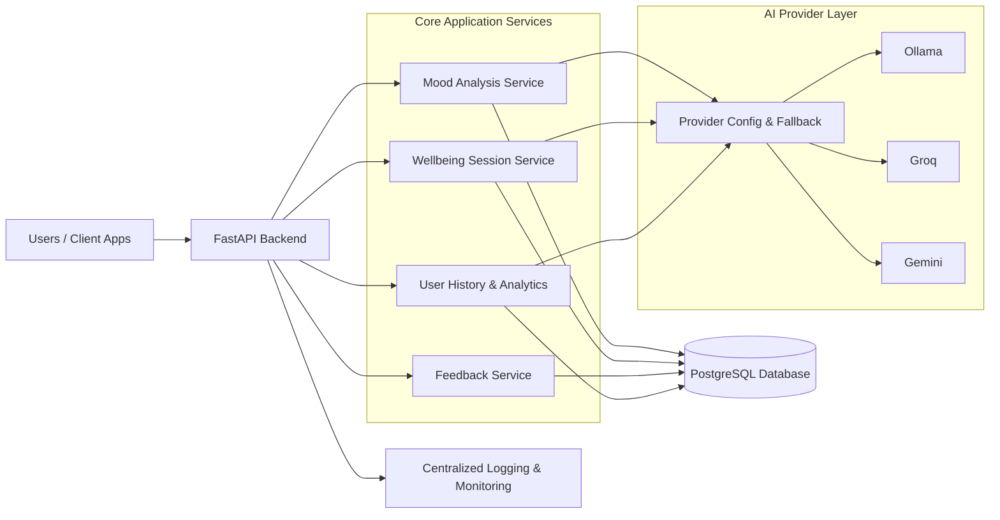

```mermaid id="0m7iz0"
flowchart LR

    %% CLIENTS
    USER[Users / Client Apps]

    %% API
    API[FastAPI Backend]

    %% CORE SERVICES
    subgraph CORE["Core Application Services"]

        MOOD[Mood Analysis Service]
        WELL[Wellbeing Session Service]
        FEED[Feedback Service]
        HIST[User History & Analytics]

    end

    %% LLM
    subgraph AI["AI Provider Layer"]

        CFG[Provider Config & Fallback]

        OLLAMA[Ollama]
        GROQ[Groq]
        GEMINI[Gemini]

    end

    %% DATABASE
    DB[(PostgreSQL Database)]

    %% LOGGING
    LOG[Centralized Logging & Monitoring]

    %% FLOWS
    USER --> API

    API --> MOOD
    API --> WELL
    API --> FEED
    API --> HIST

    MOOD --> CFG
    WELL --> CFG
    HIST --> CFG

    CFG --> OLLAMA
    CFG --> GROQ
    CFG --> GEMINI

    MOOD --> DB
    WELL --> DB
    FEED --> DB
    HIST --> DB

    API --> LOG
```
