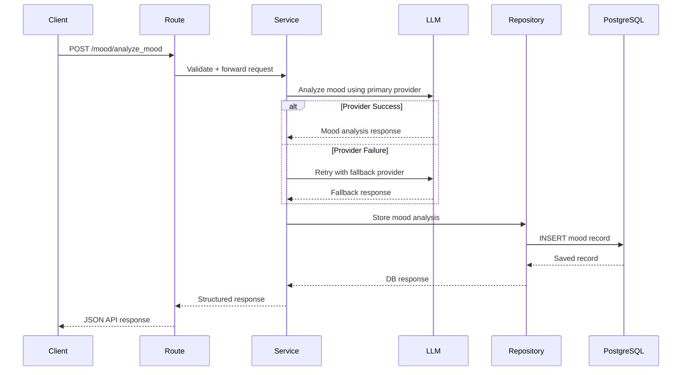

```mermaid
sequenceDiagram

    participant Client
    participant Route
    participant Service
    participant LLM
    participant Repository
    participant PostgreSQL

    Client->>Route: POST /mood/analyze_mood
    Route->>Service: Validate + forward request

    Service->>LLM: Analyze mood using primary provider

    alt Provider Success
        LLM-->>Service: Mood analysis response
    else Provider Failure
        Service->>LLM: Retry with fallback provider
        LLM-->>Service: Fallback response
    end

    Service->>Repository: Store mood analysis
    Repository->>PostgreSQL: INSERT mood record

    PostgreSQL-->>Repository: Saved record
    Repository-->>Service: DB response

    Service-->>Route: Structured response
    Route-->>Client: JSON API response
```
